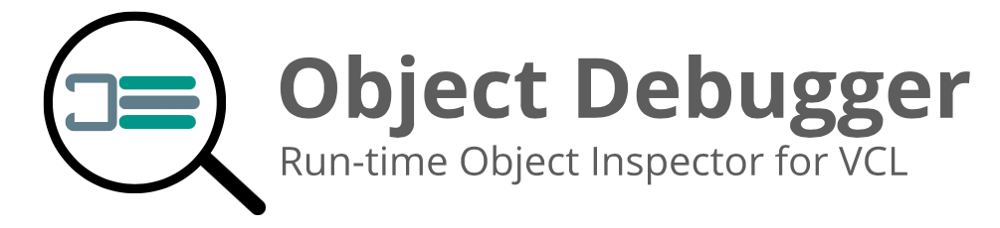

   
  

# What's new in Object Debugger 2.0.0

* The project is now independent

## Support

**Object Debugger** is an component created for **Delphi**. If you find it useful, please consider supporting it.

<table align="center" width="60%" border="0">
  <tr>
    <td>
      
    </td>
    <td>
      
    </td>
    <td>
      
    </td>
  </tr>
</table>

# Object Debugger

The **Object Debugger** is a run-time Object Inspector for Delphi VCL applications

> The **original project** was released by **Marco Cantù** at http://github.com/marcocantu/ObjectDebugger. Since its release in 2016, I decided to [make some contributions](https://github.com/marcocantu/ObjectDebugger/pulls/alefragnani), but most of them were not merged. So, I decided to evolve this fork.

## Usage

The component is very simple. Just drop it on you `MainForm` :smile:. When you open your application, its window will appear. It looks, and works, like **Delphi Object Inspector**, but at run-time. 

You just have to open the desired form, choose the component and change its properties. 

Alternatively, you can also use `Ctrl + Click` on any component in the application's form and the component will be automatically selected/updated in the **Object Debugger**.

## Compatibility

It currently supports the following Delphi versions:

* Delphi Seattle
* Delphi Berlin
* Delphi Tokyo

## Installation

* Clone the repo `https://github.com/alefragnani/delphi-object-debugger.git`
* Open the `ObjectDebugger.dpk` package
* Compile and Install

---

## License

This project is covered by _two licenses_

The **original code** developed by **Marco Cantù**, and the [contributions that I made](https://github.com/marcocantu/ObjectDebugger/pulls/alefragnani) on that original code, are licensed under [MPL 2.0](https://www.mozilla.org/en-US/MPL/2.0/)

The **contributions** that I made on new source files are licensed under [MIT](https://opensource.org/licenses/MIT)